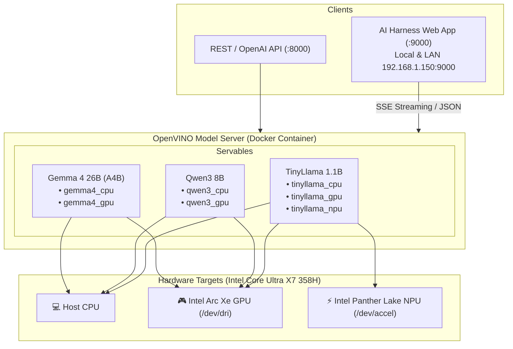

# AI Performance – OpenVINO Model Server & AI Harness

A multi-model, multi-accelerator serving system powered by **Intel OpenVINO Model Server (OVMS)** with continuous batching and an integrated **AI Harness** chat web application.

## System Architecture



## Model Matrix

| Model | Size | Parameters | Context Window | Target Devices | Quantization |
| :--- | :--- | :--- | :--- | :--- | :--- |
| **TinyLlama 1.1B Chat** | 631 MB | 1.1 Billion | 2,048 tokens | CPU, GPU, NPU | INT4 |
| **Qwen3 8B Chat** | 4.86 GB | 8.23 Billion | 32,768 tokens | CPU, GPU | INT4 |
| **Gemma 4 26B-A4B** | 15.3 GB | 26B (4B Active) | 262,144 tokens | CPU, GPU | INT4 |

## Submodules
- [`AI_harness`](./AI_harness): Browser chat application with hardware compute switcher, thinking mode selector, model specs sidebar, and real-time profiler.

## Quick Start
```bash
# Clone with submodules
git clone --recurse-submodules https://github.com/tolokedf/AI_performance.git
cd AI_performance

# Start OVMS container
./start.sh

# Start AI Harness Web App
cd AI_harness && ./start.sh
```

## Network Access
- **AI Harness Web App**: `http://localhost:9000` or `http://<LAN_IP>:9000`
- **OVMS OpenAI API**: `http://localhost:8000/v3/chat/completions`
- **OVMS Health & Status**: `http://localhost:8000/v1/config`
