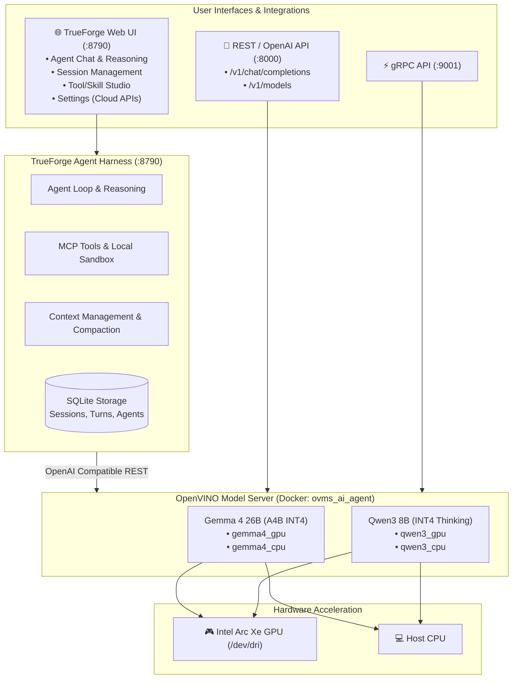

# AI Agent 2.0 – OpenVINO Model Server & TrueForge Agent Harness

A high-performance AI agent platform powered by **Intel OpenVINO Model Server (OVMS)** with Intel Arc GPU acceleration and the open-source **TrueForge** agent harness.

## System Architecture



## Model Matrix

| Model | Parameters | Quantization | Context Window | Target Devices | Highlights |
| :--- | :--- | :--- | :--- | :--- | :--- |
| **Gemma 4 26B (A4B)** | 26 Billion (4B Active) | INT4 | 262,144 tokens | Intel Arc GPU, CPU | MoE architecture, fast throughput, ultra-long context |
| **Qwen3 8B** | 8.23 Billion | INT4 | 32,768 tokens | Intel Arc GPU, CPU | Deep reasoning with explicit `<think>` thought chains |

## Quick Start

### 1. Launch the Full Stack (OVMS + TrueForge)
```bash
./start_agent.sh
```
This automatically verifies OpenVINO Model Server is running on port 8000, starts TrueForge on port 8790, and synchronizes the local OpenVINO model provider.

### 2. Access the Web Application
Open your browser at:
- **Localhost Web UI**: [http://localhost:8790](http://localhost:8790)
- **Local Network (LAN IP) Web UI**: `http://<LAN_IP>:8790` (e.g. [http://192.168.1.150:8790](http://192.168.1.150:8790))

### 3. Stop the Agent Harness
```bash
# Stop TrueForge harness
./stop_agent.sh

# Stop both TrueForge and the OVMS container
./stop_agent.sh --all
```

## Managing Inference Models & Cloud Providers

### Local Models (OpenVINO Model Server)
- **`openvino/gemma4-gpu`**: Gemma-4 26B running with hardware acceleration on Intel Arc GPU.
- **`openvino/qwen3-gpu`**: Qwen3 8B running with hardware acceleration on Intel Arc GPU.
- **`openvino/gemma4-cpu`**: Fallback to CPU execution.
- **`openvino/qwen3-cpu`**: Fallback to CPU execution.

### Cloud Providers (BYOK)
In the TrueForge Web UI, click **Settings -> Model Providers** to configure external cloud APIs:
- **Google Gemini** (Gemini 2.5 / 3.x Flash / Pro)
- **OpenAI** (GPT-4o, GPT-5.x)
- **Anthropic Claude** (Claude 3.5 Sonnet / Haiku / Opus)
- **Fireworks / Together AI / DeepSeek**

## Endpoints Summary

| Service | Port | Endpoint | Description |
| :--- | :--- | :--- | :--- |
| **TrueForge UI & API** | `8790` | `http://localhost:8790/`<br>`http://<LAN_IP>:8790/` | Main web agent chat interface (accessible on LAN) |
| **TrueForge API Docs** | `8790` | `http://localhost:8790/api/v1/docs` | OpenAPI specification and interactive docs |
| **OVMS OpenAI REST** | `8000` | `http://localhost:8000/v1/chat/completions`<br>`http://<LAN_IP>:8000/v1/chat/completions` | Standard OpenAI-compatible chat endpoint |
| **OVMS Models List** | `8000` | `http://localhost:8000/v1/models` | List of models currently loaded in OVMS |
| **OVMS gRPC** | `9001` | `localhost:9001` / `<LAN_IP>:9001` | High-throughput gRPC streaming |
